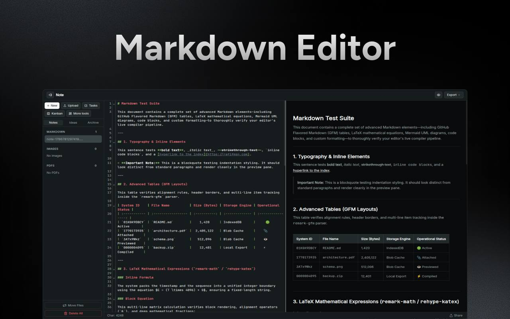

# Note - rafifmsn/tool



A privacy-first, local-first multi-files markdown editor. Full feature list:

- Live markdown preview with LaTeX (KaTeX), Mermaid diagrams, and syntax highlighting (Shiki)
- File rename, delete, move between tabs, and bulk delete
- Export as markdown, pdf, bulk export for tab and all files as zip.
- Resizable editor/preview split panel with show/hide toggle
- Char/token count toggle and share url with QR in the editor status bar
- File uploads: markdown, images (lightbox preview), PDFs (inline viewer)
- Kanban board with drag-and-drop, inline card editing, JSON export/import

> More tools are upcoming (will be placed flex-wrap beside kanban)

Consider copy and paste the test file from [TEST.md](./TEST.md) into the editor panel to see it in action.

## Quick Start

```bash
npm install
npm run dev
npm run build
```

## Project Structure

```
src/
  components/       .astro templates + client .ts logic
    editor/         CodeMirror editor panel + preview
    kanban/         Kanban board, cards, drag-and-drop
    modals/         Lightbox, file upload
    navigation/     Sidebar (file tree, tabs), Topbar (export)
    ui/             Confirm tooltip, buttons
  pages/            Route pages (index, kanban, share)
  services/db.ts    IndexedDB schema + CRUD (Dexie)
  utils/            Pure logic: editor, preview renderer,
                    markdown pipeline, export, QR, codec
  styles/           Global CSS (Tailwind v4 themes)
```

## Key Design Decisions

- **IndexedDB (Dexie)** — All data stays client-side. Unlike `localStorage`, it's not readable from sibling origins, offers larger storage quotas, and supports structured data (blobs for images/PDFs).
- **Tab system** — Files are scoped to tabs (Notes, Ideas, Archive). The DB schema supports adding/removing tabs in the future. Delete All only affects the active tab.
- **Share via encoded URL** — Content is gzip-compressed → base64url-encoded → appended as `?content=` param. The `/share` page decodes and renders it in a read-only editor. Click **Add to Editor** to save it to your workspace.
- **QR codes** — The share modal generates a QR code for the encoded URL (disabled when URL exceeds 2000 chars to avoid unreliable scanning).
- **Export** — Single file (Markdown/PDF), current tab (ZIP), or all files+attachments (ZIP).
- **CDN Externalization (Import Maps)** — Large third-party libraries (`shiki`, `mermaid`, and `codemirror`) are marked as external in Vite's build settings and loaded in production via HTML Import Maps from ESM.sh to minimize `/dist` asset size (reducing it by over 90%). The npm packages are kept in `package.json` for TypeScript type support and running Vitest tests locally.

## Sharing Integration Guide

You can generate direct sharing links to Note `/share?content=` programmatically from external scripts, CLI tools, or web services. The app expects the markdown content to be compressed with **GZIP** and then encoded in a URL-safe **Base64** format (replacing `+` with `-`, `/` with `_`, and removing trailing padding `=` characters).

Here is a browser-compatible JavaScript snippet to generate these share links:

```javascript
async function generateShareLink(domain, content) {
  // 1. GZIP compress content
  const textEncoder = new TextEncoder();
  const rawBytes = textEncoder.encode(content);
  const blob = new Blob([rawBytes]);
  const compressedStream = blob
    .stream()
    .pipeThrough(new CompressionStream("gzip"));
  const buffer = await new Response(compressedStream).arrayBuffer();

  // 2. Base64 encode and make URL-safe
  const binary = Array.from(new Uint8Array(buffer), (b) =>
    String.fromCharCode(b),
  ).join("");
  const safeBase64 = btoa(binary)
    .replace(/\+/g, "-")
    .replace(/\//g, "_")
    .replace(/=+$/, "");

  return `${domain}/share?content=${safeBase64}`;
}
```

Or in Node.js:

```javascript
import zlib from "zlib";

function generateShareLinkNode(domain, content) {
  const compressed = zlib.gzipSync(content);
  const safeBase64 = compressed
    .toString("base64")
    .replace(/\+/g, "-")
    .replace(/\//g, "_")
    .replace(/=+$/, "");
  return `${domain}/share?content=${safeBase64}`;
}
```
